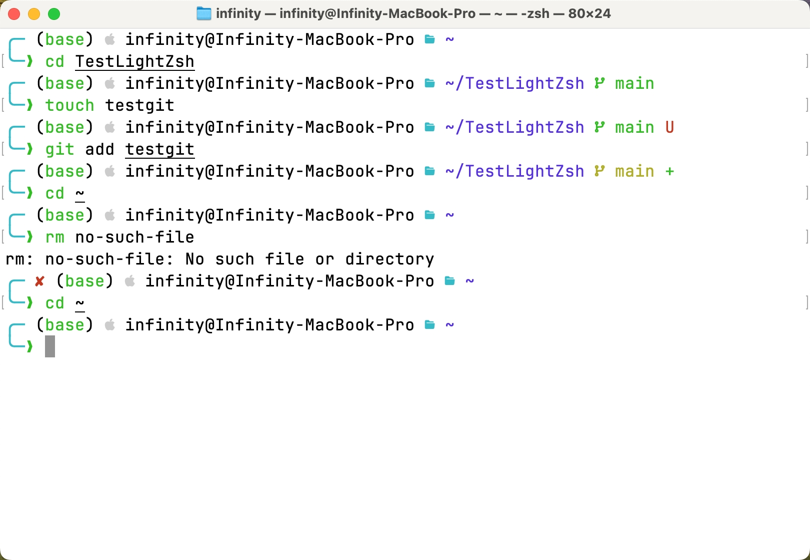
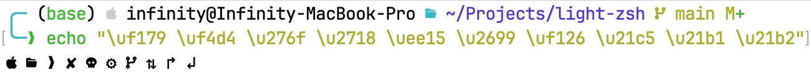

# Light-Zsh Theme

**Light-Zsh** is a lightweight and clean Zsh theme optimized for light-colored terminals, especially the native macOS terminal. Perfect for those who prefer a minimalistic and fast terminal experience.



## Features

- **Error Indication**: The theme displays a clear indicator whenever the previous command fails, ensuring you never miss an error.
- **Root User Alert**: If you are operating as the root user, the theme will show a prominent indicator to remind you of your elevated privileges.
- **Background Jobs Notification**: Keep track of your background jobs with a visible notification, so you never lose sight of your running processes.
- **Python Environment Detection**: Automatically displays your active Python environment, whether it's a virtual environment or a Conda environment, with distinct color indicators. When both environments are active, the environment corresponding to the currently used Python interpreter is displayed first, ensuring clarity on which environment is driving your session.
- **User and Hostname Display**: The prompt shows `user@hostname`, allowing you to easily identify which system you're working on, which is especially useful when managing multiple systems remotely.
- **Current Working Directory**: Your present working directory is always displayed, ensuring you know exactly where you are in the file system.
- **Git Integration**: Git branch information, dirty status, and other details are prominently displayed, allowing you to keep track of your version control status without additional commands.

## Compatibility

**Light-Zsh** requires a [Nerd Font](https://github.com/ryanoasis/nerd-fonts) to properly render all the icons and symbols used in the theme. Any Nerd Font will work, so feel free to choose one that suits your preference.

> [!TIP]
>
> For example, you can use *JetBrains Mono Nerd Font*, which is the one used in this demo.
>
> For macOS users who have installed `homebrew`, you can run the below command to install the font:
>
> ```zsh
> brew install font-jetbrains-mono-nerd-font
> ```

### Testing Font Compatibility

To ensure that your terminal is correctly displaying all icons and symbols, you can use the following command to test your Nerd Font setup:

```zsh
echo "\uf179 \uf4d4 \u276f \u2718 \uee15 \u2699 \uf126 \u21c5 \u21b1 \u21b2"
```

If you see a series of icons (such as the Apple logo, folder, and arrows) like below, your font is set up correctly.



## Installation

1. **Clone the Repository**:
   Clone the repository to your local machine:

   ```zsh
   git clone https://github.com/InfinityUniverse0/light-zsh.git
   ```

2. **Move the Theme to Your Zsh Themes Directory**:
   Copy or move the theme file to your Zsh themes directory (`~/.oh-my-zsh/custom/themes/`):

   ```zsh
   cp light-zsh/light-zsh.zsh-theme ~/.oh-my-zsh/custom/themes/
   ```

3. **Set the Theme in Your `.zshrc` File**:
   Open your `.zshrc` file and set the `ZSH_THEME` variable:

   ```zsh
   ZSH_THEME="light-zsh"
   ```

4. **Apply the Changes**:
   Reload your Zsh configuration by running:

   ```zsh
   source ~/.zshrc
   ```

Your terminal should now be using the Light-Zsh theme, displaying all the useful information you need at a glance.

## Notes

Feel free to adjust the details to better suit your preferences or to add any other instructions specific to your setup.

## Contact

For any questions, suggestions, or feedback, feel free to reach out:

- **Email**: wtxInfinity@outlook.com
- **GitHub Issues**: [Issues Page](https://github.com/InfinityUniverse0/light-zsh/issues)

Feel free to contribute, report issues, or suggest improvements!
